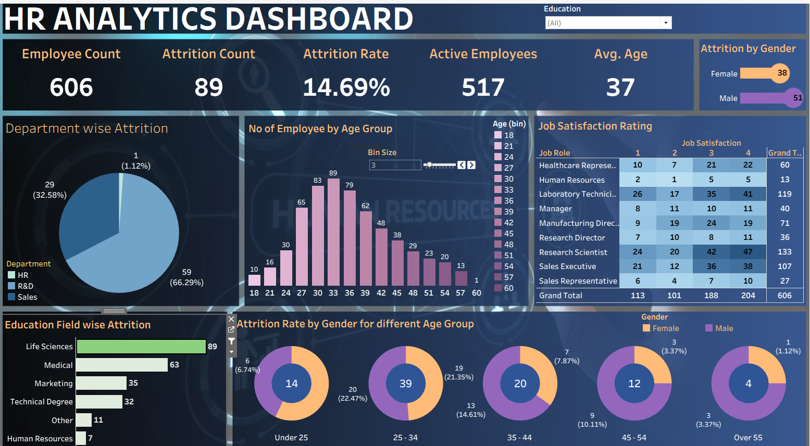

# HR Analytics Dashboard – Tableau Project

An interactive **HR Analytics Dashboard** built in Tableau to analyze employee attrition, satisfaction, and workforce demographics. The dashboard helps HR teams identify attrition patterns across departments, age groups, gender, and education fields.

## 📊 Dashboard Preview



## 🎯 Objective

To analyze employee attrition trends and key HR metrics in order to help decision-makers understand:
- Which departments and job roles have the highest attrition
- How attrition varies across gender and age groups
- Overall job satisfaction levels across the organization
- Key workforce KPIs at a glance

## 🧩 Dashboard Components

The main dashboard **"HR ANALYSTICS DASHBOARD"** combines the following worksheets:

| Worksheet | Description |
|---|---|
| KPI | High-level summary metrics (headcount, attrition rate, etc.) |
| Attrition by Gender | Attrition split by gender |
| Attrition Rate by Gender for different Age Group | Gender-wise attrition trend across age bands |
| No of Employee by Age Group | Employee distribution by age group |
| Department wise Attrition | Attrition count/rate by department |
| Education Field wise Attrition | Attrition count/rate by education field |
| Job Satisfaction Rating | Distribution of job satisfaction scores |

## 🗂️ Dataset

The dashboard is powered by `HR Data.xlsx`, containing employee-level records with fields such as:

- **Demographics:** Age, Gender, Marital Status, Education Field, Education Level
- **Job Details:** Department, Job Role, Job Level, Business Travel, Over Time
- **Attrition Info:** Attrition (Yes/No), Age Band, Attrition Label
- **Satisfaction Metrics:** Job Satisfaction, Environment Satisfaction, Relationship Satisfaction, Work Life Balance
- **Compensation:** Monthly Income, Daily Rate, Hourly Rate, Percent Salary Hike
- **Tenure:** Total Working Years, Years at Company, Years in Current Role, Years Since Last Promotion

## 🛠️ Tools Used

- **Tableau Desktop** (2026.2) – for data visualization and dashboard building
- **Microsoft Excel** – as the data source
- **PowerPoint** – for the dashboard background design

## 📁 Repository Structure

```
Tableau Project/
├── HR Dashboard.twbx      # Packaged Tableau workbook (open this in Tableau)
├── HR Data.xlsx           # Source dataset
├── HR background.png      # Dashboard background image
├── HR background.pptx     # Background design source file
└── README.md
```

## 🚀 How to View

1. Download/clone this repository.
2. Open **`HR Dashboard.twbx`** using [Tableau Desktop](https://www.tableau.com/products/desktop) or [Tableau Public](https://public.tableau.com/) (free).
3. Explore the interactive dashboard filters and tooltips.

## 👤 Author

Created as a Tableau HR Analytics portfolio project.
